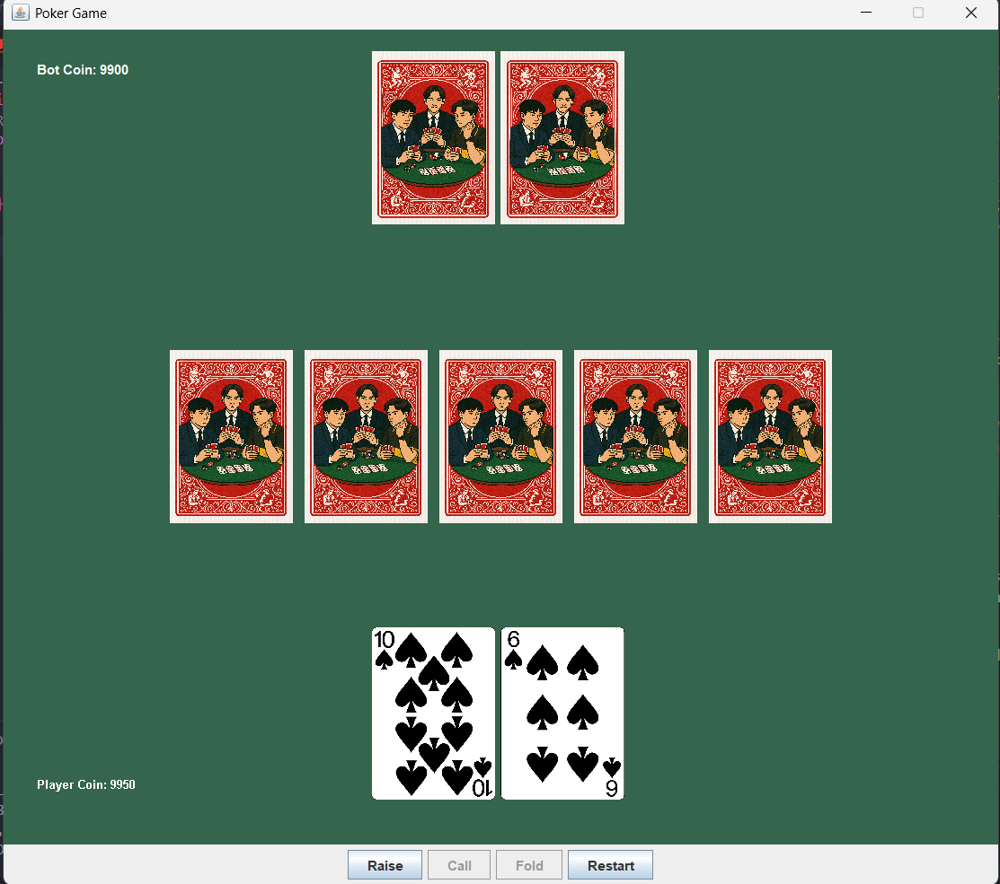

# Poker (Java)

สร้างเกม Poker ด้วยภาษา Java สำหรับผู้เริ่มต้น! ตัวอย่างนี้ใช้ไลบรารี awt และ swing เพื่อสร้างกราฟิกและอินเทอร์เฟซ

## สิ่งที่คุณจะได้เรียนรู้
- สร้างสำรับไพ่ (Deck) และสับไพ่
- แจกไพ่ให้ผู้เล่นและดีลเลอร์ (Bot)
- จัดการรอบการเดิมพัน (Betting round)
- การกระทำของผู้เล่น เช่น Call, Raise, Fold
- เปรียบเทียบผลลัพธ์เพื่อหาผู้ชนะในแต่ละรอบ
- สร้าง GUI แสดงไพ่และอัปเดตสถานะเกมแบบเรียลไทม์
- เมื่อเปิดไพ่ครบ 5 ใบ จะมีการเปิดไพ่ของ Bot อัตโนมัติ

## ตัวอย่างหน้าจอเกม

## วิธีเริ่มต้น
1. ติดตั้ง Java และ Visual Studio Code
2. เปิดโฟลเดอร์นี้ใน VS Code
3. รันไฟล์ `App.java` เพื่อเริ่มเกม

## ฟีเจอร์เพิ่มเติมที่แนะนำ
- เพิ่มช่องให้ผู้เล่นกรอกจำนวนเงินที่ต้องการเดิมพัน (ใช้ JTextField)
- เพิ่มปุ่ม "Next Game" เพื่อเริ่มเกมใหม่หลังจบรอบ
- ปรับปรุง AI ของ Bot ให้ฉลาดขึ้น

[How to setup Java with Visual Studio Code](https://youtu.be/BB0gZFpukJU)